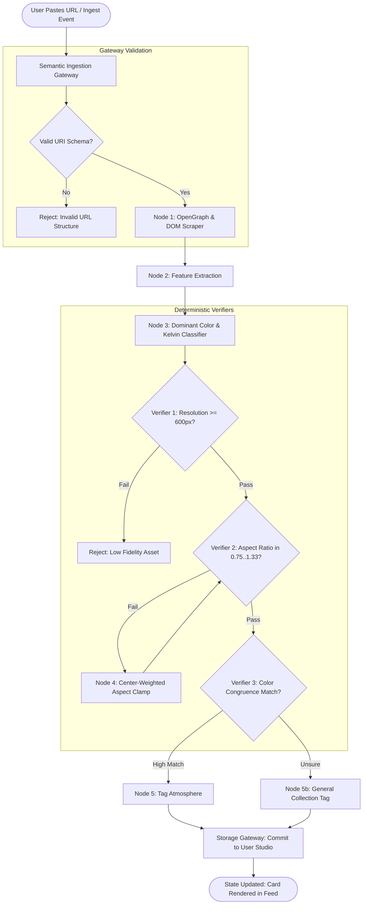

# Graph Workflows & Verifier Architecture Specification
**System:** Aether Sensory Commerce  
**Paradigm:** StateGraph Orchestration, Deterministic Harnessing & Semantic Tool Gateways  

---

## 1. Graph Workflows Overview

The application is decomposed into three primary **State Graphs**:
1. **The Atmospheric State Machine (Circadian Graph)**
2. **The Specimen Ingestion & Curation Pipeline (The Ingestion Graph)**
3. **The Studio Collage & Provenance Graph (The Acquisition Graph)**

---

## 2. Graph 1: Atmospheric State Machine (Circadian Graph)

Controls the synchronized transitions between Visual Theme, Audio Engine, and Data Filter.

```mermaid
stateDiagram-v2
    [*] --> RainStudyState: App Boot (Default)
    
    state RainStudyState {
        Theme: SlateCharcoal_Theme
        Audio: RainOnSlate_Loop
        Freq: 800Hz_4000Hz
    }
    
    state TokyoNocturneState {
        Theme: ObsidianIndigo_Theme
        Audio: TokyoDrone_Loop
        Freq: 50Hz_250Hz
    }
    
    state RawTerracottaState {
        Theme: TravertineCream_Theme
        Audio: TerracottaTape_Loop
        Freq: 200Hz_1200Hz
    }

    RainStudyState --> TransitionGate: Switch to Tokyo Nocturne
    TokyoNocturneState --> TransitionGate: Switch to Raw Terracotta
    RawTerracottaState --> TransitionGate: Switch to Rain & Study

    state TransitionGate {
        [*] --> CheckAudioConflict
        CheckAudioConflict --> CrossfadeEngine: External Audio == False
        CheckAudioConflict --> SilentThemeShift: External Audio == True
        CrossfadeEngine --> MorphTheme
        SilentThemeShift --> MorphTheme
        MorphTheme --> [*]
    }

    TransitionGate --> TokyoNocturneState: Target == Tokyo
    TransitionGate --> RawTerracottaState: Target == Terracotta
    TransitionGate --> RainStudyState: Target == Rain
```

### Deterministic State Schema:
```dart
class AtmosphereState {
  final String activeId; // 'rain_study' | 'tokyo_nocturne' | 'raw_terracotta'
  final Color backgroundColor;
  final Color surfaceColor;
  final Color primaryTextColor;
  final Color accentColor;
  final String audioAssetPath;
  final double targetVolume;
  final bool isAudioMuted;
  final bool isExternalAudioDetected;
}
```

---

## 3. Graph 2: Ingestion & Curation Pipeline (The Ingestion Graph)

When a user pastes a web link or uploads a photo, this graph processes, verifies, and commits the object.



---

## 4. Deterministic Verifier Formal Specifications

### Verifier Gate 1: Visual Resolution (Fidelity Assertion)
$$\mathcal{V}_{res}(img) = \begin{cases} \text{PASS}, & \text{if } \min(img.w, img.h) \ge 600 \land img.size \le 12\text{MB} \\ \text{FAIL}, & \text{otherwise} \end{cases}$$

### Verifier Gate 2: Aspect Ratio Bounds (Masonry Integrity)
$$\mathcal{V}_{ar}(img) = \begin{cases} \text{PASS}, & \text{if } 0.75 \le \frac{img.w}{img.h} \le 1.33 \\ \text{REPAIR}, & \text{otherwise} \end{cases}$$
*   **Repair Action:** Center-weighted crop bounding box calculated via:
    $$h_{clamped} = \min\left(h, \frac{w}{0.75}\right), \quad w_{clamped} = \min\left(w, 1.33 \times h\right)$$

### Verifier Gate 3: Crossmodal Audio-Visual Congruency
$$\Delta C(img, \text{Atmos}) = \cos(\vec{Hue}_{img}, \vec{Hue}_{\text{Atmos}})$$
$$\mathcal{V}_{congruence}(img) = \begin{cases} \text{ASSIGN}(\text{Atmos}), & \text{if } \Delta C \ge 0.65 \\ \text{FALLBACK}, & \text{otherwise} \end{cases}$$

---

## 5. Semantic Tool Gateways (Interfaces)

These gateways isolate all platform-specific dependencies:

```dart
// 1. Audio Engine Gateway
abstract class IAudioGateway {
  Future<void> initAudioSession();
  Future<void> crossfadeTo(String trackAsset, {Duration duration = const Duration(milliseconds: 400)});
  Future<void> setVolume(double volume);
  Stream<double> get amplitudeStream;
  Future<bool> checkExternalAudioActive();
}

// 2. Storage & Curation Gateway
abstract class IStorageGateway {
  Future<List<DesignSpecimen>> fetchCatalog(String atmosphereId);
  Future<void> saveSpecimen(DesignSpecimen specimen);
  Future<void> deleteSpecimen(String specimenId);
  Future<List<DesignSpecimen>> fetchStudioCollection();
  Future<void> persistPreferences(String key, dynamic value);
}

// 3. Provenance & Decompression Gateway
abstract class IProvenanceGateway {
  Future<bool> verifyArtisanUrl(String url);
  Future<void> launchArtisanStore(String url);
}
```
